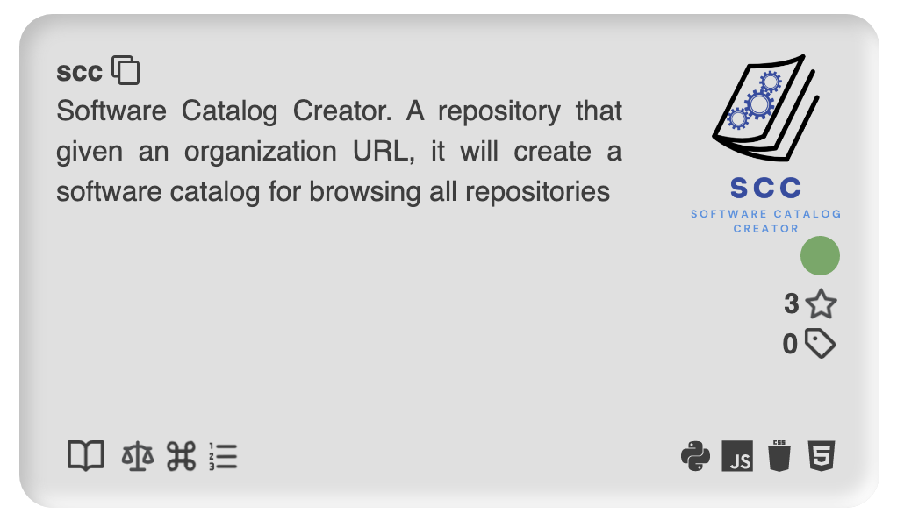

# Software Catalog Creator


A repository that given an organization URL, it will create a software catalog for browsing all repositories.

## Example

Click [here](https://dakixr.github.io/scc/example/index.html) to see an interactive example.



## Install from GitHub

```text
git clone https://github.com/dakixr/scc
cd scc
pip install -e .
```

## Usage

```text
Usage: scc [OPTIONS] COMMAND [ARGS]...

  SCC (Software Catalog Creator)

  Automatically generates a searchable portal for every repository of an
  organization/s or user/s, which is easy to host.

  Usage:

  1. (repos) Fetch all repos from the desired organization/s
  2. (extract) Extract all metadata for every repo
  3. (portal) Generate a searchable portal for all the retrieved data

Options:
  -h, --help  Show this message and exit.

Commands:
  card     Create a stand-alone card ready to be embedded in a website
  extract  Fetch and save metadata from introduced repos
  portal   Build a portal with a minimalist design
  repos    Retrieve all organization/s or user/s repositories
```

In order to use SCC you will need to follow the following pipeline:  

### 1 - Fetch repos

First thing to do is fetch all repositories pointers that we want to use. We'll use the `fetch` command.

```text
  -i, --input <name-or-path>  Organization or user name  [required]
  -o, --output <path>         Output csv file  [default: repos.csv]
  --org                       Extracting from a organization  [default: True]
  --user                      Extracting from a user  [default: False]
  -h, --help                  Show this message and exit.
```

Is important to determine if the name belongs to a user or a organization.  
`scc fetch -i dakixr --user`
`scc fetch -i oeg-upm --org -o oeg-upm_repos.csv`  

This command also accepts a file as input (names separated by a new-line).
`scc fetch -i multiple-users.csv --user -o multiple-users_repos.csv`  
`scc fetch -i multiple-orgs.csv --org -o multiple-orgs_repos.csv`  

The output of this command is a csv file with all the repos of the selected users/orgs.
At this moment is a good time to clean this file (remove all repos that you don't want to use).

### 2 - Extract metadata

Then we use the `extract` command to extract all the metadata and save it for later.

```text
  -i, --input <csv-repos>  Pointers to the repositories in csv format
                           [required]
  -o, --output <path>      Dir where repositories metadata will be saved
  -h, --help               Show this message and exit.
```

`scc extract -i oeg-upm_repos.csv -o oeg-upm_metadata`

### 3 - Build portal

This is the last step in the pipe line. For building the portal we need to use the command `portal`.

```text
  -i, --input <dir-json-metadata>
                                  Dir repositories metadata in json format
                                  [required]
  -o, --output <path>             Dir where Software Catalog Portal will be
                                  saved  [default: portal]
  -h, --help                      Show this message and exit.
```

`scc portal -i oeg-upm_metadata -o dir_portal`

If everything worked fine now a new dir should have been created with all the assets and code to deploy this portal.

### Create a stand-alone card

SCC also gives the option to create a single card in two different formats:

* HTML
* PNG

```text
  -i, --input <url>    Repository URL  [required]
  -o, --output <path>  Output file where the html will be saved  [default:
                       card]
  --html               Save card as html  [default: True]
  --png                Save card as a png  [default: False]
  -h, --help           Show this message and exit.
```

As input you will need a github repository url and also an output format, the default is HTML.

`scc card -i https://github.com/oeg-upm/scc --html`  
`scc card -i https://github.com/oeg-upm/scc --png`
